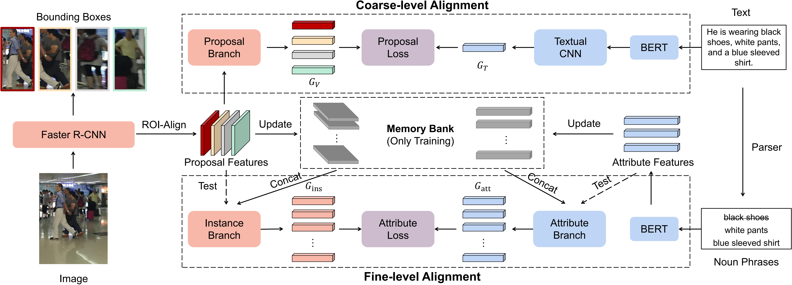

### Introduction

This repository hosts the source code of our paper: [[SIGIR 2024\]MACA: Memory-aided Coarse-to-fine Alignment for Text-based Person Search](https://dl.acm.org/doi/abs/10.1145/3626772.3657915). MACA achieves the **state-of-the-art** performance on two benchmarks (*i.e.*, CUHK-SYSU-TBPS and PRW-TBPS). 




### Installation

This project is developed upon [MMDetection](https://github.com/open-mmlab/mmdetection), we utilized python=3.8, pytorch=1.10.0, mmcv=1.6.0, mmdetection=2.26.0

Note: Make sure that your compilation CUDA version and runtime CUDA version match. You can check the supported CUDA version for precompiled packages on the [PyTorch website](https://pytorch.org/).

```shell
# 1. create an env
conda create --name MACA python=3.8

# 2. activate
conda activate MACA

# 3. install torch
pip install torch==1.10.0+cu111 torchvision==0.11.0+cu111 torchaudio==0.10.0 -f https://download.pytorch.org/whl/torch_stable.html

or

conda install pytorch==1.10.0 torchvision==0.11.0 torchaudio==0.10.0 cudatoolkit=11.3 -c pytorch -c conda-forge

# 4. install package
cd MACA
pip install -e .
```


### Dataset

Download the dataset from [CUHK-SYSU](https://github.com/ShuangLI59/person_search) and [PRW](https://github.com/liangzheng06/PRW-baseline), the text annotation can be obtained from [CUHK-SYSU-TBPS && PRW-TBPS](https://github.com/Dacun/Text-based-Person-Search).

Put the dataset in the /data dictionary, the structure as follows:

    data
    ├── bert_emb.py
    ├── CUHK-SYSU-TBPS/
    │   ├── CUHK-SYSU-TBPS_train
    │   ├── CUHK-SYSU-TBPS_test
    │   ├── annotation/
    │   ├── Image/
    │   └── ...
    └── PRW-TBPS/
        ├── PRW-TBPS_train
        ├── PRW-TBPS_test
        ├── annotations/
        ├── frames/
        ├── query_box/
        └── ...

Then run `python bert_emb.py` to generate text tokens and attention masks for each text description from pre-trained BERT.


Modify the dataset directories (`data_root`) below:

- CUHK-SYSU-TBPS: [config file](./configs/_base_/datasets/cuhk_sysu_tbps.py)
- PRW-TBPS: [config file](./configs/_base_/datasets/prw_tbps.py)


### Experiments

1. Train

```shell
# sh script config_file num_GPUs

# train CUHK-SYSU-TBPS
bash tools/dist_train.sh configs/text-based_person_search/MACA_CUHK_faster_rcnn.py 4

# train PRW-TBPS
bash tools/dist_train.sh configs/text-based_person_search/MACA_PRW_faster_rcnn.py 4
```


2. Test CUHK-SYSU-TBPS

```shell
python tools/test.py configs/text-based_person_search/MACA_CUHK_faster_rcnn.py MACA_CUHK_SYSU_TBPS_epoch_25.pth
```


3. Test PRW-TBPS

```shell
python tools/test.py configs/text-based_person_search/MACA_PRW_faster_rcnn.py MACA_PRW_TBPS_epoch_25.pth
```


### Performance

|    Dataset     |  mAP  | Top-1 | Top-5 | Top-10 |                             Link                             |
| :------------: | :---: | :---: | :---: | :----: | :----------------------------------------------------------: |
| CUHK-SYSU-TBPS | 57.77 | 52.03 | 76.71 | 83.79  | [model](https://drive.google.com/file/d/1qnehgeaXRUTQRpwlo7dvQSkvMSHewEFF/view?usp=sharing) |
|    PRW-TBPS    | 18.18 | 33.25 | 52.87 | 61.93  | [model](https://drive.google.com/file/d/1aFkCqPUuV6c1vGEwdLwlMbwdrW-5Urk1/view?usp=sharing) |


### Citation

```
@inproceedings{su2024maca,
  title={MACA: Memory-aided Coarse-to-fine Alignment for Text-based Person Search},
  author={Su, Liangxu and Quan, Rong and Qi, Zhiyuan and Qin, Jie},
  booktitle={Proceedings of the 47th International ACM SIGIR Conference on Research and Development in Information Retrieval},
  pages={2497--2501},
  year={2024}
}
```

